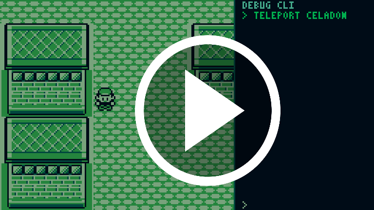

# pokered-c
[](https://www.youtube.com/watch?v=9b1up4gAVDE)
The original Game Boy assembly is the spec. Every mechanic is ported from the disassembly rather than approximated.

**Status:** Playable from intro through Vermilion/SS Anne, Celadon Rocket Game Corner/Hideout, and Lavender/Pokémon Tower core sequences (including rival + Marowak + Mr. Fuji rescue flow). Core Gen 1 battle flow, Pokédex/PC systems, TM/HM teaching, and ongoing ASM-fidelity polish are integrated.

## Release notes

- Full file-level release ledger (2026-04-13): [`bugs/release_ledger_2026-04-13.md`](bugs/release_ledger_2026-04-13.md)

## What's implemented

### Overworld
- Walking, NPC interaction, map connections, ledge jumping
- Warps (doors, cave exits, underground paths) with fade transition
- Item pickup from overworld
- Wild encounter detection (grass tiles, random rate)
- Trainer sight detection — exclamation emote, walk-up, battle trigger
- Field move hooks and key-item map hooks (including Poké Flute integration path)
- Save/load

### Story scripts (Pallet → Rocket Hideout + Lavender/Pokémon Tower coverage)
- **Intro & main menu** — Game Freak logo, title screen, new game / continue
- **Pallet Town** — Oak intro, player naming
- **Oak's Lab** — starter selection dialogue, rival pick, receive Pokédex, Oak's Parcel delivery chain
- **Viridian City** — Mart locked until Parcel delivered; Old Man tutorial
- **Viridian Forest** — trainer encounters (Bug Catcher parties)
- **Pewter City and Brock** — Pewter city Youngster guide sequence implemented to ASM spec, Brock battle and post battle sequence implemented to ASM spec.
- **Mt. Moon** — trainer encounters, cave exit warps
- **Route 22 / Cerulean / Route 24-25** — rival/event flows, Nugget Bridge chain, trainers, Bill's House sequence
- **S.S. Anne chapter** — rival battle and captain/HM01 Cut sequence integrated with associated trainer/event scripting - SS anne exit animation isnt perfect yet.
- **Vermilion Gym script path** — gym-specific script module and puzzle/event scaffolding integrated
- **Celadon Gym / Erika battle and TM sequence**  — Gym leader Erika is fully battleable with event flag set up, TM given after victory. 
- **Celadon / Rocket Hideout** — Game Corner poster Rocket encounter + switch, staircase reveal behavior, spinner movement/animation/SFX flow, Lift Key drop sequence, elevator panel flow, Giovanni encounter + Silph Scope drop sequence
- **Lavender / Pokémon Tower** — 2F rival sequence, 5F purified-zone behavior, 6F ghost Marowak reveal + battle flow, 7F Rocket encounters + Mr. Fuji rescue/warp chain, Mr. Fuji house Poké Flute reward flow
- **Event flags** — persistent across save/load; completed events stay completed

### Battle engine (Gen 1 faithful)
- Turn structure: move selection, priority, speed order
- Damage formula: types, STAB, critical hits, random factor
- All status conditions (PAR, SLP, PSN, BRN, FRZ) with Gen 1 mechanics
- Move effects via effect ID table (mirrors pokered effect handler dispatch)
- Experience gain, level-up, stat recalculation
- Post-battle evolution flow integrated (with continued timing/visual parity refinements)
- Pokémon switching (voluntary + forced on faint)
- Item use in battle (Potion, Antidote, status heals, Pokéballs)
- Catch mechanic — Gen 1 catch rate formula, shake count
- Trainer battles — trainer sprite slide-in/out, send-out text, win/loss handling, prize money, badge checks
- 8 battle transition animations keyed on trainer/wild/dungeon/stronger-enemy
- Move animation pipeline integrated and actively parity-polished against ASM behavior
- Full battle UI: HP bars, status icons, party dots, move menu, bag/switch/run submenus

Move animation disclaimer:
- Move animations are integrated, but approximately 75% remain untested/unverified against ASM parity.
- Some animations may still have visual/timing/SFX mismatches or edge-case bugs.

### UI screens
- **Start menu** — Pokédex (when obtained), Pokémon party, bag, save, exit (player card/option still stubbed)
- **Bag** — item list and use
- **Party menu** — party Pokémon with sprite icons
- **Summary screen** — stats, moves, Pokédex entry
- **Pokédex** — species list + side action menu (`DATA/CRY/AREA/QUIT`) and detail viewer
- **PC menu** — top-level PC selection and Bill-style box operations (deposit/withdraw/release/change box)
- **Pokémart** — buy/sell with Gen 1 item list layout, quantity picker, ¥ pricing
- **Pokémon Center** — nurse dialogue, healing machine animation, party restore

### Audio
- Full music playback from pokered-master score data
- Per-map music: Pallet Town, Viridian City, Pewter City, Cerulean City, Vermilion City, Lavender Town, Celadon City, Mt. Moon, Oak's Lab, Viridian Forest, and more
- Pokémon cries (pitch + tempo modifiers per species)
- SFX: purchase, level-up, healing machine, ball poof, faint, run, ledge hop, key item fanfare, collision, go inside/outside

### Data (extracted from pokered-master)
- All 151 Pokémon front/back sprites
- Party icon tiles for all species
- Level-up movesets and evolution chains
- All trainer parties
- Pokémon cry definitions

## What's missing / in progress

### Campaign coverage
- Large portions beyond current Vermilion/Celadon/Lavender coverage remain incomplete or partial
- Late-game city arcs, Team Rocket mid/late story beats, and endgame routes are not fully scripted yet
- Gym progression beyond currently integrated chapters is still in progress

### Trainer AI
- Currently uses basic move selection; Gen 1 AI heuristics not yet ported

### Menus / parity polish
- START menu entries for player card / options are still stubs
- Some subsystems are functionally implemented but still being tuned for frame/timing/audio parity against ASM behavior

## Prerequisites

| Tool         | Notes                                                  |
| ------------ | ------------------------------------------------------ |
| C11 compiler | GCC via MSYS2/MinGW64 on Windows; `gcc` on Linux/macOS |
| CMake ≥ 3.16 |                                                        |
| SDL2         | `pacman -S mingw-w64-x86_64-SDL2` on MSYS2             |
| Python 3     | Only needed to regenerate data files from `tools/`     |

> **Windows note:** `CMakeLists.txt` currently hardcodes `C:/msys64/mingw64` as the SDL2 search path. Edit that line if your MSYS2 is installed elsewhere, or remove it on Linux/macOS.

## pokered-master

The data-extraction tools in `tools/` read from the original pokered disassembly. Clone it into the project root:

```sh
git clone https://github.com/pret/pokered pokered-master
```

You only need this if you want to regenerate `src/data/` files. The generated files are already committed, so a normal build does not require it.

## Build

```sh
cmake -B build -DCMAKE_BUILD_TYPE=Release
cmake --build build
./build/pokered
```

On Windows with MSYS2:
```sh
cmake -B build -G "MinGW Makefiles" -DCMAKE_BUILD_TYPE=Release
cmake --build build
./build/pokered.exe
```

## Tests

```sh
cmake --build build --target pokered_tests
./build/pokered_tests
# or via CTest:
cd build && ctest
```

## Controls

| Key | Action |
|---|---|
| Arrow keys | Move / navigate menus |
| Z | A button (confirm, interact) |
| X | B button (cancel, back) |
| Enter | Start |

### Debug render / rewind keys
- `--debug-render` launch mode: fixed `512x288` window (logical `256x144`) with in-window CLI sidebar
- `~` / `Shift+~`: toggle debug CLI typing mode in debug-render
- Hold `Ctrl+Z`: rewind backward frame-by-frame
- Hold `Ctrl+Y`: redo/forward frame-by-frame

## Debug tooling

- Debug CLI command reference: [`docs/debug-and-tooling/game_cli_commands.md`](docs/debug-and-tooling/game_cli_commands.md)
- Debug system guide (replay, rewind, quicksave/csave, telemetry): [`docs/debug-and-tooling/debug_cli_tools_guide.md`](docs/debug-and-tooling/debug_cli_tools_guide.md)
- Build notes: [`docs/debug-and-tooling/pokered-build.md`](docs/debug-and-tooling/pokered-build.md)

Runtime debug outputs:
- `bugs/cli_state.txt` (CLI state snapshots)
- `bugs/session_narrative.log` (human-readable session log)
- `bugs/session_events.jsonl` (structured event stream, including event-flag transitions and battle start/end summaries)

## Data extraction tools

After cloning `pokered-master`, regenerate `src/data/` files with:

```sh
python tools/extract_maps.py
python tools/extract_events.py
python tools/extract_data.py
python tools/extract_sprites.py
python tools/extract_audio.py
python tools/extract_cries.py
python tools/extract_party_icons.py
```

## Built with

Developed using [Claude Code](https://claude.ai/code) with [monet-code](https://github.com/acastango/monet-code) for persistent project memory across sessions.

## Legal

This project contains no ROM data or proprietary Nintendo assets. It references the [pret/pokered](https://github.com/pret/pokered) open disassembly only for structure and layout information. Pokémon is a trademark of Nintendo / Game Freak.
